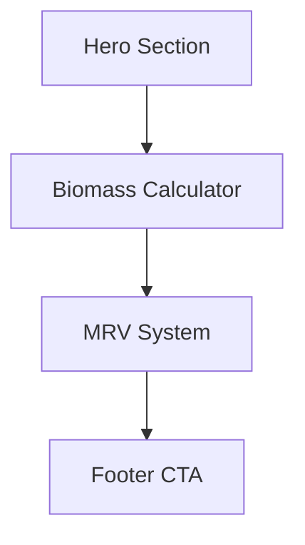

## 1. Product Overview
Biochar Thailand 101 is a single-page web application that educates users about biochar technology and its economic benefits. The application demonstrates how agricultural waste can be converted into valuable biochar while addressing PM2.5 pollution and creating carbon credits for the global market.

The target audience includes Thai farmers, agricultural businesses, and environmentally conscious individuals interested in sustainable waste management and additional income streams.

## 2. Core Features

### 2.1 User Roles
This application does not require user registration or authentication. It's a public educational tool accessible to all visitors.

### 2.2 Feature Module
Our biochar education application consists of the following main sections:
1. **Hero Section**: Introduction to biochar concept with visual timeline
2. **Biomass Calculator**: Interactive tool to estimate biochar yield and potential income
3. **MRV Tracking System**: Demonstration of monitoring, reporting, and verification system
4. **Footer with Call-to-Action**: Links to community group and developer information

### 2.3 Page Details
| Page Name | Module Name | Feature description |
|-----------|-------------|---------------------|
| Single Page Application | Hero Section | Display headline "เปลี่ยนวัสดุเหลือใช้...ให้กลายเป็นรายได้" with 3-step visual timeline showing biomass to biochar conversion process |
| Single Page Application | Biomass Calculator | Material type selector (rice husk, corn cob, bamboo, fruit branch), quantity input field, calculate button, and animated results display showing biochar yield, CO2 removal, and potential value |
| Single Page Application | MRV System | GPS location verification with mock blockchain hash generation, furnace temperature input, and verification status display |
| Single Page Application | Footer CTA | Facebook group link to "มาแลกต้นไม้กัน" community and developer attribution link |

## 3. Core Process
**Visitor Flow:**
1. User lands on the page and sees hero section explaining biochar concept
2. User scrolls to biomass calculator and selects waste material type
3. User inputs quantity and clicks calculate button
4. System displays animated results showing biochar yield, carbon credits, and estimated value
5. User can explore MRV system demonstration by getting GPS location
6. User can join the Facebook community group via footer link

## 4. User Interface Design

### 4.1 Design Style
- **Primary Color**: Emerald Green (bg-emerald-600, text-emerald-700) - Represents nature and agriculture
- **Secondary Color**: Charcoal Black (bg-gray-900) - Represents biochar
- **Accent Color**: Amber/Gold (text-amber-500) - Represents income and wealth
- **Button Style**: Rounded corners with soft shadows (shadow-lg, rounded-xl)
- **Font**: Google Fonts 'Kanit' for modern Thai aesthetic
- **Layout**: Clean, card-based design with mobile-first approach
- **Icons**: Emoji-style icons for visual appeal and cultural relevance

### 4.2 Page Design Overview
| Page Name | Module Name | UI Elements |
|-----------|-------------|-------------|
| Single Page | Hero Section | Full-width hero banner with Thai headline, subheading explaining PM2.5 and carbon credits, three-step timeline cards with emoji icons and smooth transitions |
| Single Page | Calculator | Material selection dropdown with Thai labels, numeric input field with ton unit, large prominent calculate button with hover effects, three result cards with count-up animation |
| Single Page | MRV System | Form with current date/time display, temperature input field, GPS verification button with location icon, verification status card with mock blockchain hash |
| Single Page | Footer | Call-to-action text, primary button linking to Facebook group, secondary developer attribution link |

### 4.3 Responsiveness
Mobile-first design approach with responsive breakpoints. The application must display perfectly on iPhone and Android screens, with touch-optimized interactions and appropriate font sizes for mobile readability.

### 4.4 Animation Requirements
- Count-up animation for calculator results
- Smooth scrolling between sections
- Hover effects on interactive elements
- Loading spinner for GPS verification process