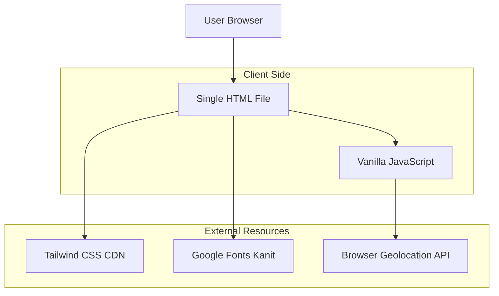

## 1. Architecture Design



## 2. Technology Description

- **Frontend**: Vanilla HTML5 + Tailwind CSS + Vanilla JavaScript
- **Styling**: Tailwind CSS via CDN (https://cdn.tailwindcss.com)
- **Typography**: Google Fonts 'Kanit' for Thai language support
- **Deployment**: Cloudflare Workers (single file deployment)
- **Backend**: None (static single-page application)
- **Database**: None (client-side calculations only)

## 3. Route Definitions

This is a single-page application with no routing. All content is displayed on one URL:
- `/` - Main application page containing all four sections

## 4. Core JavaScript Functions

### 4.1 Biomass Calculator Logic
```javascript
function calculateBiochar() {
  // Input validation and calculation
  // Formula: Biochar Yield = Input * 0.30 (30%)
  // Formula: Carbon Credit = Biochar Yield * 2.8
  // Formula: Value = (Biochar Yield * 1000 * 5) + (Carbon Credit * 3000)
}
```

### 4.2 MRV GPS Verification
```javascript
function getGPSLocation() {
  // Uses navigator.geolocation.getCurrentPosition
  // Displays loading state
  // Shows mock blockchain hash on success
  // Handles permission denied scenarios
}
```

### 4.3 Animation Functions
```javascript
function animateValue(element, start, end, duration) {
  // Count-up animation for calculator results
  // Smooth number transition effect
}
```

## 5. Data Models

This application does not persist data. All calculations are performed client-side with the following temporary data structure:

```javascript
const calculationResult = {
  biomassInput: number,      // User input in tons
  materialType: string,     // Selected material type
  biocharYield: number,     // Calculated biochar output (30% of input)
  carbonCredit: number,     // Calculated carbon credits (2.8 * biocharYield)
  estimatedValue: number, // Total value in THB
  timestamp: Date          // Calculation timestamp
}

const mrvRecord = {
  furnaceTemp: number,      // User input temperature
  location: {
    latitude: number,       // GPS coordinates
    longitude: number
  },
  verificationHash: string, // Mock blockchain hash
  timestamp: Date           // Verification timestamp
}
```

## 6. Browser APIs Used

- **Geolocation API**: For GPS location verification in MRV system
- **DOM Manipulation**: For dynamic content updates and animations
- **Event Handling**: For user interactions and form submissions

## 7. Performance Considerations

- Single file deployment ensures fast loading
- CDN resources for CSS and fonts improve caching
- Client-side calculations eliminate server latency
- Mobile-first design optimized for 3G/4G networks
- No external dependencies beyond CDN resources

## 8. Error Handling

- Input validation for negative numbers in calculator
- GPS permission denied handling with user-friendly messages
- Fallback for geolocation API unavailability
- Graceful degradation for animation support